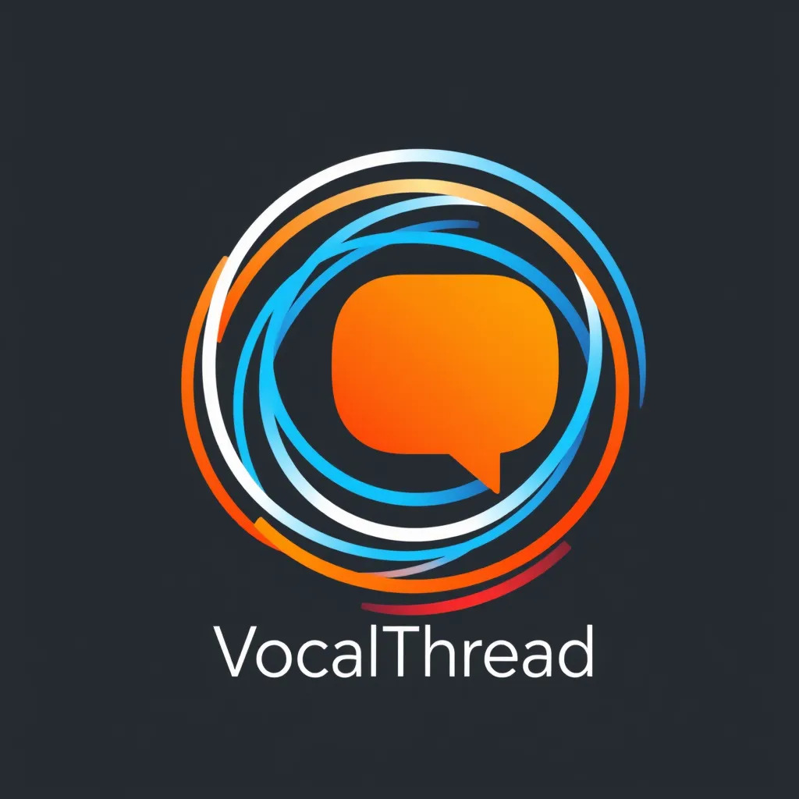

<p align="center">
   <br/>
  <span style="font-size: 2em;">🎤 Vocal Thread 💬</span> <br/> 
  <span style="font-style: italic;">Where Comments Become Conversations</span>
</p>

**Vocal Thread** elevates YouTube comment analysis by adding an auditory dimension to the insights provided by [CommentScope](https://comment-scope.streamlit.app/).  By leveraging ElevenLabs' cutting-edge text-to-speech (TTS) technology, VocalThread transforms written comments into dynamic audio dialogues, offering a richer and more engaging way to understand audience sentiment and discussion trends.


## Key Features

* **ElevenLabs Integration:**  High-quality voice synthesis powered by the ElevenLabs API, with options for voice customization based on comment sentiment.  Currently integrated with core features like comment summarization, in-depth analysis, video summarization, and chatting with comments.

* **Comment-to-Speech Conversion:**  Transforms written YouTube comments into spoken audio, preserving the context and emotional tone of the original text.  This allows for a more immersive and accessible understanding of audience feedback.

* **Unique Voices for Comments (Planned):**  Future development aims to assign distinct voices to different commenters, enhancing the listening experience and potentially differentiating between sentiment or user characteristics.

* **Audio Summarization:**  Converts text summaries generated by CommentScope into spoken audio, providing a concise audio overview of the comment section's key themes and sentiments.

* **Interactive Audio Playback (Basic):**  A user-friendly interface within the Streamlit app allows for navigating and listening to audio comments.  Basic playback controls are included, with future plans for more advanced features like speed control and filtering.

## Technical Implementation

* **Frontend:** Streamlit framework for interactive user experience.
* **Backend:** Python with libraries like `googleapiclient`, `textblob`, `wordcloud`, `google.generativeai`, `youtube_transcript_api`, `elevenlabs`, and more.
* **API Integration:**  ElevenLabs API for TTS, YouTube Data API for comment retrieval, and Gemini API for language processing.

## How to Run Locally

1. **Clone the repository:**

   ```bash
   git clone https://github.com/djpapzin/Vocal-Thread.git
   ```

2. **Navigate to the project directory:**

   ```bash
   cd Vocal-Thread
   ```

3. **Install required packages:**

   ```bash
   pip install -r requirements.txt
   ```

4. **Set up API keys:**
   - Rename the existing `.streamlit/secrets copy.toml` file to `.streamlit/secrets.toml`:
     ```bash
     ren ".streamlit/secrets copy.toml" ".streamlit/secrets.toml"  // On Windows
     mv ".streamlit/secrets copy.toml" ".streamlit/secrets.toml" // On Linux/macOS
     ```
   - **Obtain API Keys:**
     - **Gemini API Key:** Create a key at [https://aistudio.google.com/app/apikey](https://aistudio.google.com/app/apikey)
     - **YouTube Data API Key:** 
       1. Enable the YouTube Data API v3 at [https://console.cloud.google.com/marketplace/product/google/youtube.googleapis.com](https://console.cloud.google.com/marketplace/product/google/youtube.googleapis.com?q=search&referrer=search)
       2. Create an API key at [https://console.cloud.google.com/apis/credentials](https://console.cloud.google.com/apis/credentials?)(Create Credentials --> API Key)
     - **ElevenLabs API Key:** 
       1. Create an ElevenLabs account at [https://elevenlabs.io/sign-up](https://elevenlabs.io/sign-up)
       2. Log in and click on your profile picture in the lower-left corner --> "Profile + API key".

   - Add your obtained API keys within the `.streamlit/secrets.toml` file, following the structure below:

   ```toml
   [general]
   GEMINI_API_KEY = "YOUR_GEMINI_API_KEY"
   YOUTUBE_API_KEY = "YOUR_YOUTUBE_API_KEY"
   ELEVENLABS_API_KEY = "YOUR_ELEVENLABS_API_KEY"
   ```

5. **Run the Streamlit app:**

   ```bash
   streamlit run app.py
   ```

## Future Enhancements

* **Multilingual Support:**  Add language selection for comment audio.
* **Improved Error Handling:**  Robust handling of invalid YouTube links and other potential errors.
* **Enhanced Chat Functionality:**  Refine the "Chat with Comments" feature using advanced language models.
* **Mobile App/Chrome Extension:**  Explore extending VocalThread to mobile platforms or as a browser extension.
* **Advanced Audio Playback:** Implement features like playback speed control, skipping, and filtering.

## Potential Challenges

* **API Usage and Costs:**  Managing API usage within budget constraints.
* **Accurate Emotional Tone:**  Ensuring accurate translation of emotion and context from text to speech.
* **Multilingual and Accent Handling:**  Addressing the complexities of diverse languages and accents.


## Contributing

Contributions are welcome! Please feel free to submit issues and pull requests.

## Team

* **@djpapzin:** Project Manager, AI/LLM, Backend Developer
* **@AGINerd:** Backend Developer, Live Presentation
* **@wam9965_19081:** Video Presentations


This project aims to enhance YouTube comment analysis by adding an auditory dimension, potentially unlocking new insights and user experiences.